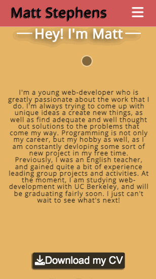
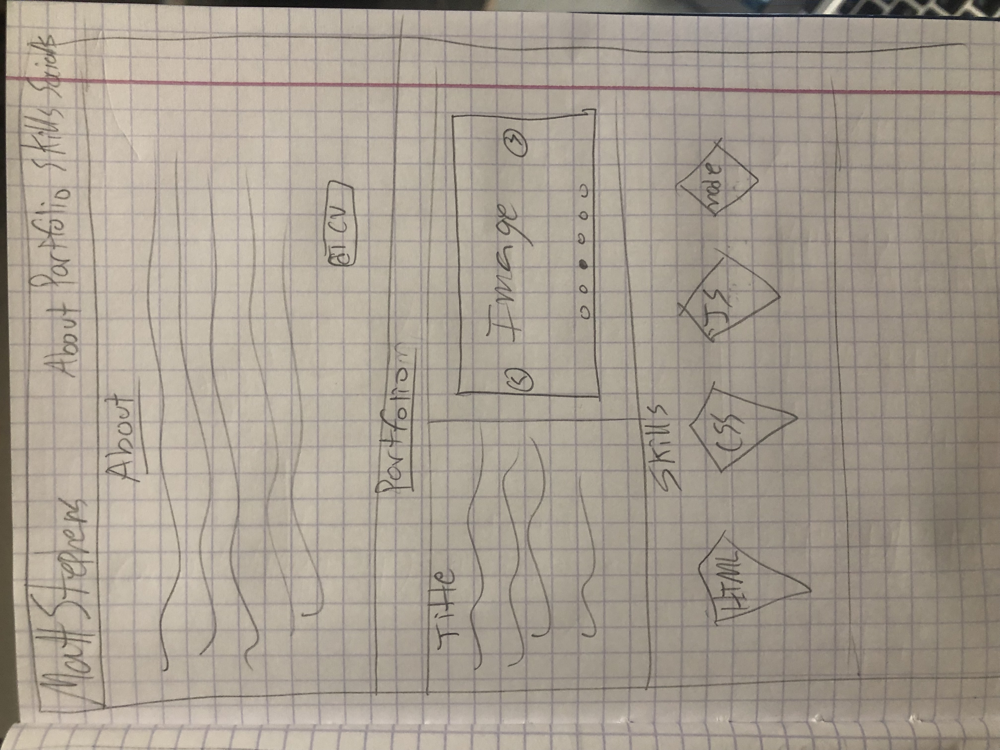

# Matt Stephens Portfolio **([Link](https://mstephen19.github.io/newestPortfolio))**

This is my new portfolio website which features a more professional design, as well as some of my newest personal and school-related projects.



## Original WireFrame Layout



## Built With

- [HTML](https://developer.mozilla.org/en-US/docs/Web/HTML)
- [CSS](https://developer.mozilla.org/en-US/docs/Web/CSS)
- [Javascript](https://developer.mozilla.org/en-US/docs/Web/JavaScript)
- [Flickity](https://flickity.metafizzy.co/)
- [usefulJS](https://github.com/mstephen19/usefulJS-library)
- [FontAwesome](https://fontawesome.com)
- [Google Fonts](https://fonts.google.com/)
- [ColorHunt](https://colorhunt.co/) (for color pallete)
- [Meyer Web reset.css file](https://meyerweb.com/eric/tools/css/reset/)

## Notable Stuff

### Javascript logic used to change navbar position and opacity based on scroll position within the main sections:

```Javascript
sections.addEventListener('scroll', ()=>{
  //cl(sections.scrollTop);
    if (sections.scrollTop >= 250)  {
      navbar.classList.add('fixed');
      navbar.classList.add('hidden');
      burgerMenu.classList.add('hideBurger');
    } else {
      navbar.classList.remove('hidden');
      navbar.classList.remove('fixed');
      burgerMenu.classList.remove('hideBurger');
      el(footer).hide()
    }
    if (sections.scrollTop >= 2100) {
      el(footer).showFlex()
    } else {
      el(footer).hide()
    }
})
```

### CSS scroll snapping sections:

```CSS
* {
  scroll-behavior: smooth;
}

#sectionsContainer {
  height: 100vh;
  scroll-snap-type: y mandatory;
  overflow-y: scroll;
}
```

## Deployed Link

- [Live Site Here](https://mstephen19.github.io/newestPortfolio)

## Author

**Matt Stephens**

- [Link to Portfolio Site](https://mstephen19.github.io/newestPortfolio)
- [Link to Github](https://github.com/mstephen19)
- [Link to LinkedIn](https://www.linkedin.com/mstephen19)

### Acknowledgments

- Shoutout to [Jesse Lewis](https://www.linkedin.com/in/jesseaustinlewis/) for helping me find bugs with the mobile version of the site
